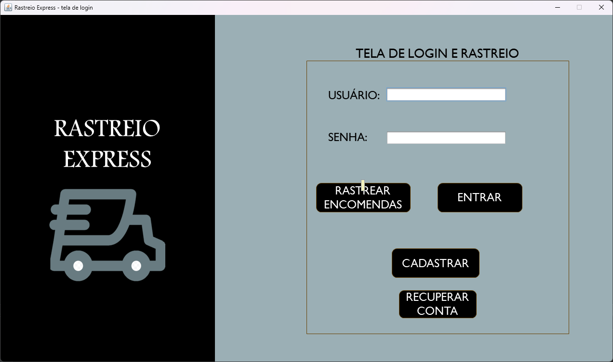
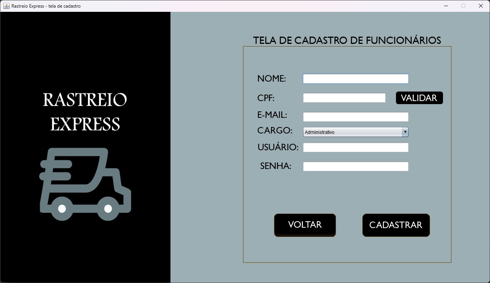
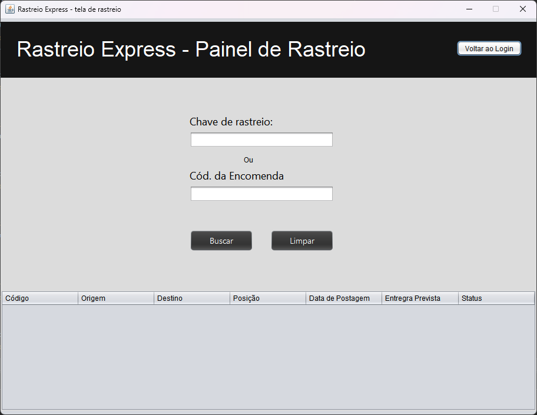
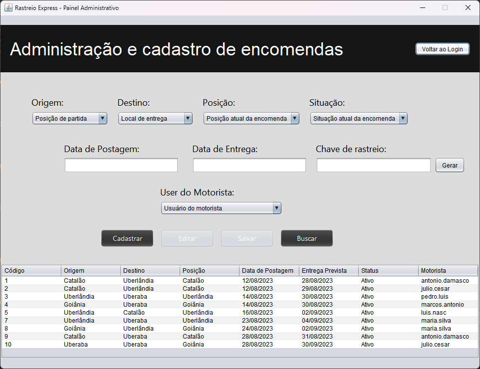
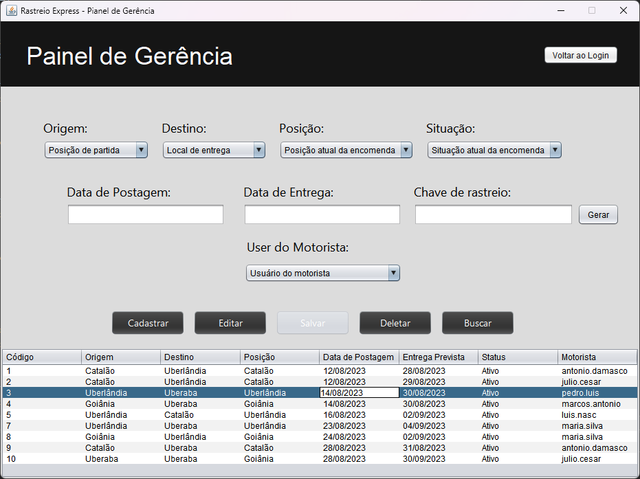

# RastreioExpress
“RastreioExpress” is an order management system, being suitable for small and medium-sized shipping companies. Its management system have functionalities to help the companies to control their orders and its movement; these functionalities ar: order registration, edit, and delete. 
Also, the software have a user management system, in which it is possible to register an administrator user and a manager user, who is the one with the greatest power within the system, being the only one able to delete an order. 
Technically, the software was made with the following technologies:
- Java;
- Swing;
- MySQL;
- MVC software architecture.
Ps: the program must be runned in the netbeans IDE.
# Screenshots

  
  
  
  
  
  

